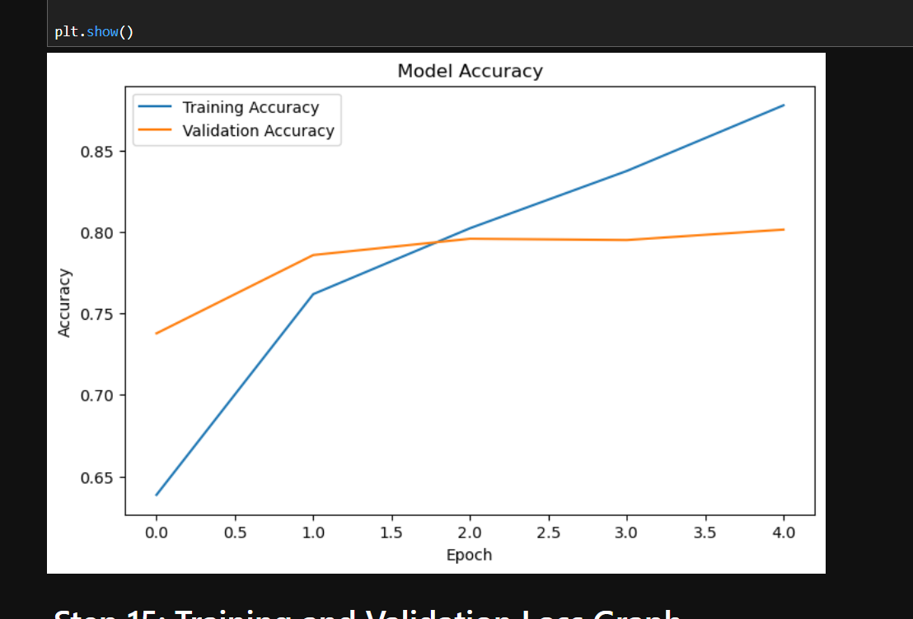

# 🐱🐶 Cat vs Dog Image Classification using CNN

## 📌 Project Overview

This project uses a Convolutional Neural Network (CNN) to classify images as either Cats or Dogs.

The model was trained on a dataset containing over 25,000 images and deployed using Streamlit for real-time predictions.

---

## 🎯 Business Problem

Manually identifying and classifying large numbers of animal images can be time-consuming.

The objective of this project is to build a deep learning model that can automatically classify an image as either:

- Cat
- Dog

---

## 📂 Dataset Information

Dataset Size: 25,002 Images

- Cats: 12,501 Images
- Dogs: 12,501 Images

Dataset Source:
https://www.kaggle.com/datasets

---

## 🛠 Technologies Used

- Python
- TensorFlow
- Keras
- NumPy
- Matplotlib
- Streamlit
- Jupyter Notebook

---

## 🧠 CNN Architecture

The model consists of:

- Input Layer (128 × 128 × 3)
- Conv2D Layer (32 Filters)
- MaxPooling2D Layer
- Conv2D Layer (64 Filters)
- MaxPooling2D Layer
- Flatten Layer
- Dense Layer (128 Neurons)
- Dropout Layer (0.5)
- Output Layer (Sigmoid)

Activation Function:
- ReLU
- Sigmoid

Optimizer:
- Adam

Loss Function:
- Binary Crossentropy

---

## 📊 Model Performance

| Metric | Value |
|----------|----------|
| Training Accuracy | 87.75% |
| Training Loss | 0.2935 |
| Validation Accuracy | 80.13% |
| Validation Loss | 0.4835 |

---

## 📈 Training Results

The model achieved:

- Training Accuracy: 87.75%
- Validation Accuracy: 80.13%

The model successfully classified unseen images with high confidence scores.

Examples:

- Cat → 97.15% Confidence
- Dog → 89.66% Confidence

---

## 🚀 Deployment

The trained CNN model was deployed using Streamlit.

Features:

- Upload an image
- Real-time prediction
- Confidence score display
- User-friendly interface

---

## 📸 Project Screenshots

## Model Summary

## Accuracy Graph

## Loss Graph

## Cat Prediction

## Dog Prediction

## Streamlit Deployment

---

## ✅ Advantages

- Automated image classification
- Reduces manual effort
- Learns image features automatically
- Real-time prediction through web application

---

## ⚠ Limitations

- Accuracy can be improved further
- Sensitive to low-quality images
- Requires computational resources for training

---

## 🔮 Future Enhancements

- Data Augmentation
- Transfer Learning (VGG16, ResNet50)
- Higher Accuracy Models
- Cloud Deployment
- Multi-Class Image Classification

---

## 🏁 Conclusion

A Convolutional Neural Network (CNN) was successfully developed to classify cat and dog images.

The model achieved 80.13% validation accuracy and was able to predict unseen images effectively.

The project was further deployed using Streamlit, allowing users to upload images and receive real-time predictions through a web application.

---

## 👨‍💻 Author

AJU

Aspiring AI Engineer | Machine Learning | Deep Learning | GenAI
